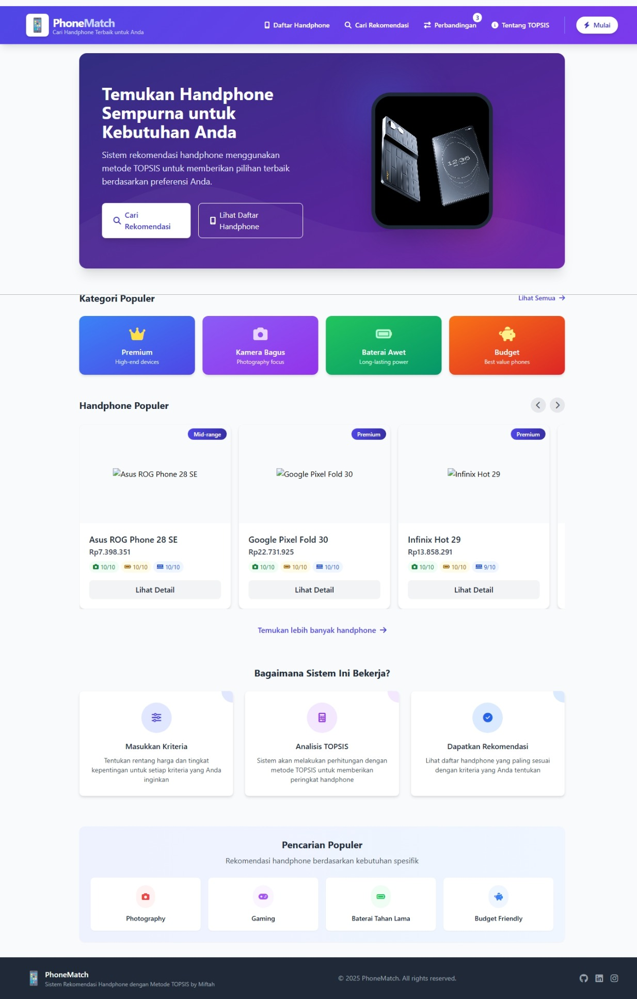

# PhoneMatch - Sistem Rekomendasi Handphone dengan Metode TOPSIS


## Website PhoneMatch


<div align="center">
  <a href="#fitur"><strong>Fitur</strong></a> &nbsp;&nbsp;•&nbsp;&nbsp;
  <a href="#teknologi"><strong>Teknologi</strong></a> &nbsp;&nbsp;•&nbsp;&nbsp;
  <a href="#instalasi"><strong>Instalasi</strong></a> &nbsp;&nbsp;•&nbsp;&nbsp;
  <a href="#penggunaan"><strong>Penggunaan</strong></a> &nbsp;&nbsp;•&nbsp;&nbsp;
  <a href="#metodologi"><strong>Metodologi</strong></a> &nbsp;&nbsp;•&nbsp;&nbsp;
  <a href="#kontribusi"><strong>Kontribusi</strong></a>
</div>

<br>

## 📱 Tentang PhoneMatch

PhoneMatch adalah sistem pendukung keputusan berbasis web yang dirancang untuk membantu pengguna menemukan handphone terbaik berdasarkan preferensi mereka. Menggunakan metode TOPSIS (Technique for Order Preference by Similarity to Ideal Solution), sistem ini menganalisis berbagai kriteria handphone seperti kamera, baterai, performa, dan harga untuk memberikan rekomendasi yang dipersonalisasi.



## ✨ Fitur

### 🔍 Pencarian & Rekomendasi
- **Sistem Rekomendasi TOPSIS**: Memberikan rekomendasi handphone berdasarkan preferensi pengguna
- **Kustomisasi Kriteria**: Memungkinkan pengguna menentukan bobot untuk setiap kriteria (kamera, baterai, RAM, prosesor)
- **Filter Harga**: Memfilter rekomendasi dalam rentang harga yang diinginkan
- **Visualisasi Hasil**: Menampilkan hasil rekomendasi dengan visualisasi skor

### 📊 Katalog & Perbandingan
- **Daftar Handphone**: Katalog lengkap handphone dengan informasi detail
- **Pencarian & Pemfilteran**: Mencari handphone berdasarkan nama, harga, dan fitur
- **Kategori Khusus**: Menelusuri handphone premium, budget, kamera terbaik, dan baterai tahan lama
- **Detail Produk**: Melihat spesifikasi lengkap dan skor kinerja setiap handphone

### ℹ️ Edukasi & Informasi
- **Halaman Tentang TOPSIS**: Penjelasan mendalam tentang metodologi TOPSIS
- **Visualisasi Perhitungan**: Ilustrasi visual tentang cara kerja algoritma rekomendasi
- **Transparansi Skor**: Menampilkan detail perhitungan skor untuk setiap handphone

## 🛠️ Teknologi

### Frontend
- **Blade Templates**: Template engine Laravel untuk UI yang dinamis
- **Tailwind CSS**: Framework CSS untuk desain responsif dan modern
- **Alpine.js**: Framework JavaScript ringan untuk interaktivitas
- **Font Awesome**: Ikon-ikon UI yang menarik

### Backend
- **Laravel 10**: Framework PHP untuk pengembangan aplikasi web
- **MySQL**: Database relasional untuk penyimpanan data
- **TOPSIS Algorithm**: Implementasi algoritma TOPSIS untuk rekomendasi multi-kriteria

### Infrastruktur
- **Laragon**: Setup pengembangan lokal
- **Git**: Kontrol versi kode
- **Composer**: Manajemen dependensi PHP

## 🚀 Instalasi

### Prasyarat
- PHP >= 8.1
- Composer
- MySQL
- Node.js & NPM (opsional, untuk asset building)

### Langkah-langkah Instalasi

1. **Clone repositori**
   ```bash
   git clone https://github.com/mifta24/spk-hp-topsis.git
   cd spk-hp-topsis
   ```

2. **Instal dependensi PHP**
   ```bash
   composer install
   ```

3. **Salin file konfigurasi**
   ```bash
   cp .env.example .env
   ```

4. **Konfigurasi database**
   Buka .env dan atur koneksi database:
   ```
   DB_CONNECTION=mysql
   DB_HOST=127.0.0.1
   DB_PORT=3306
   DB_DATABASE=spk_hp_topsis
   DB_USERNAME=root
   DB_PASSWORD=
   ```

5. **Generate application key**
   ```bash
   php artisan key:generate
   ```

6. **Migrate dan seed database**
   ```bash
   php artisan migrate --seed
   ```

7. **Jalankan development server**
   ```bash
   php artisan serve
   ```

8. **Akses aplikasi**
   Buka browser dan kunjungi `http://localhost:8000`

## 📖 Penggunaan

### Mencari Rekomendasi Handphone

1. **Tentukan Preferensi**
   - Buka halaman "Cari Rekomendasi"
   - Atur rentang harga yang diinginkan
   - Tentukan tingkat kepentingan untuk setiap kriteria (kamera, baterai, RAM, prosesor)

2. **Lihat Hasil**
   - Sistem akan menampilkan daftar handphone yang direkomendasikan
   - Lihat skor TOPSIS untuk setiap handphone
   - Bandingkan spesifikasi dan fitur

3. **Eksplorasi Detail**
   - Klik pada handphone untuk melihat informasi lebih detail
   - Bandingkan dengan rekomendasi lainnya
   - Baca tentang kelebihan dan kekurangan

### Menjelajahi Katalog Handphone

1. **Telusuri Kategori**
   - Pilih kategori handphone (premium, mid-range, entry-level, budget)
   - Filter berdasarkan fitur utama (kamera bagus, baterai tahan lama, dll)

2. **Gunakan Filter**
   - Filter berdasarkan rentang harga
   - Urutkan berdasarkan nama, harga, atau rating
   - Cari handphone tertentu dengan kata kunci

3. **Lihat Detail**
   - Klik pada kartu handphone untuk melihat spesifikasi lengkap
   - Baca ulasan dan rating fitur
   - Lihat gambar produk

## 📊 Metodologi

### TOPSIS (Technique for Order Preference by Similarity to Ideal Solution)

PhoneMatch mengimplementasikan metode TOPSIS untuk memberikan rekomendasi handphone. TOPSIS adalah metode pengambilan keputusan multi-kriteria yang didasarkan pada konsep bahwa alternatif terbaik harus memiliki jarak terdekat dari solusi ideal positif dan jarak terjauh dari solusi ideal negatif.

#### Langkah-langkah Algoritma TOPSIS:

1. **Membangun Matriks Keputusan**
   - Setiap handphone (alternatif) dinilai berdasarkan kriteria yang ditentukan

2. **Normalisasi Matriks Keputusan**
   - Mengubah nilai kriteria menjadi nilai yang tidak berdimensi

3. **Pemberian Bobot pada Matriks Ternormalisasi**
   - Menerapkan bobot yang ditentukan pengguna pada matriks

4. **Menentukan Solusi Ideal Positif dan Negatif**
   - Mengidentifikasi nilai terbaik dan terburuk untuk setiap kriteria

5. **Menghitung Jarak ke Solusi Ideal**
   - Menghitung jarak Euclidean dari setiap alternatif ke solusi ideal positif dan negatif

6. **Menghitung Skor Preferensi**
   - Menghitung nilai preferensi untuk setiap alternatif

7. **Mengurutkan Alternatif**
   - Mengurutkan handphone berdasarkan skor preferensi


## 📁 Struktur Database

### Tabel Utama

#### handphones
- `id`: Primary key
- `name`: Nama handphone
- `price`: Harga handphone
- `camera`: Skor kamera (1-10)
- `battery`: Skor baterai (1-10)
- `ram`: Skor RAM (1-10)
- `processor`: Skor prosesor (1-10)
- `created_at`: Timestamp pembuatan
- `updated_at`: Timestamp pembaruan

#### specifications
- `id`: Primary key
- `handphone_id`: Foreign key ke tabel handphones
- `image`: URL gambar handphone
- `ram_size`: Ukuran RAM (GB)
- `storage_size`: Ukuran penyimpanan (GB)
- `battery_capacity`: Kapasitas baterai (mAh)
- `camera_mp`: Resolusi kamera (MP)
- `processor_name`: Nama prosesor
- `screen_size`: Ukuran layar (inch)
- `os`: Sistem operasi
- `created_at`: Timestamp pembuatan
- `updated_at`: Timestamp pembaruan

## 🔧 Konfigurasi

### Konfigurasi Bobot Default

Anda dapat mengubah bobot default untuk algoritma TOPSIS di file konfigurasi:

```php
// config/topsis.php

return [
    'default_weights' => [
        'camera' => 3,
        'battery' => 3,
        'ram' => 3,
        'processor' => 3,
    ],
    'price_ranges' => [
        'budget' => ['min' => 0, 'max' => 2000000],
        'entry' => ['min' => 2000000, 'max' => 4000000],
        'mid' => ['min' => 4000000, 'max' => 8000000],
        'premium' => ['min' => 8000000, 'max' => null],
    ],
];
```

## 🛠️ Pemecahan Masalah

### Masalah Umum

**Perhitungan TOPSIS tidak berjalan dengan benar:**
- Pastikan semua kriteria memiliki data valid
- Periksa bobot yang diberikan tidak nol
- Pastikan setidaknya ada perbedaan nilai pada setiap kriteria

**Gambar handphone tidak muncul:**
- Periksa apakah URL gambar valid
- Pastikan koneksi internet aktif untuk gambar eksternal
- Periksa izin direktori penyimpanan untuk gambar lokal

## 👥 Kontribusi

Kontribusi pada PhoneMatch sangat dihargai! Berikut cara untuk berkontribusi:

1. Fork repositori
2. Buat branch fitur (`git checkout -b feature/AmazingFeature`)
3. Commit perubahan (`git commit -m 'Add some AmazingFeature'`)
4. Push ke branch (`git push origin feature/AmazingFeature`)
5. Buka Pull Request

### Panduan Kontribusi

- Patuhi coding style Laravel
- Tambahkan komentar pada kode yang kompleks
- Buat unit test untuk fitur baru
- Update dokumentasi jika diperlukan

## 📜 Lisensi

Didistribusikan di bawah Lisensi MIT. Lihat `LICENSE` untuk informasi lebih lanjut.

## 📞 Kontak

Miftah - [@Mifta24](https://github.com/Mifta24) - miftah@example.com

Project Link: [https://github.com/mifta24/spk-hp-topsis](https://github.com/mifta24/spk-hp-topsis)

## 🙏 Pengakuan

- [Laravel](https://laravel.com)
- [Tailwind CSS](https://tailwindcss.com)
- [Font Awesome](https://fontawesome.com)
- [Flaticon](https://www.flaticon.com) untuk ikon PhoneMatch

---

<div align="center">
  <sub>Built with ❤️ by Miftah</sub>
</div>
